# AI Agent

### Concepts

#### What is "LLM"?

LLM is a transformer model trained to predict the next word.
- You can think of training LLMs as training parrots to mimic human languages.
- In inference period, you can jsut use examples as input: few-shot prompting.

For example, we got the wrong answer:

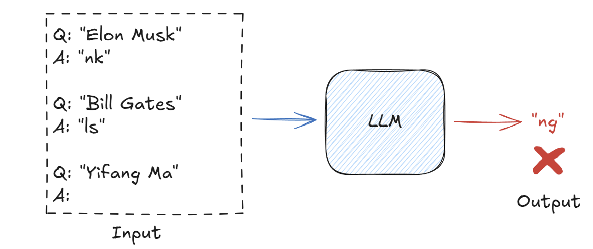

To fix the error output, we just add "reasoning process" before "answer":

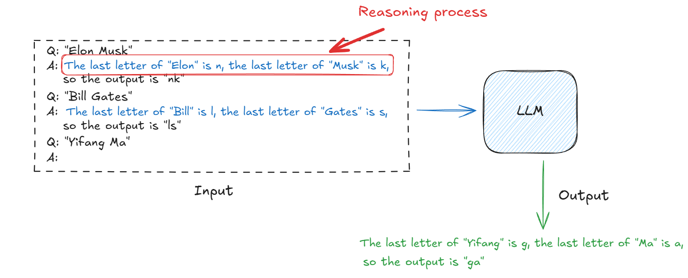

#### What is "Agent"?

What is agent? An "intelligent" system that interacts with some "environment".
- Physical environments: robot, autonomous vehicles, etc.
- Humans as environments: chatbot
- Digital environments: Siri, AlphaGo, etc.

#### What is "LLM Agent"?

We have three categories.
- Text agent: Use text action and observation.
- LLM agent: use LLM to act.
- Reasoning agent: Use LLM to reason to act.

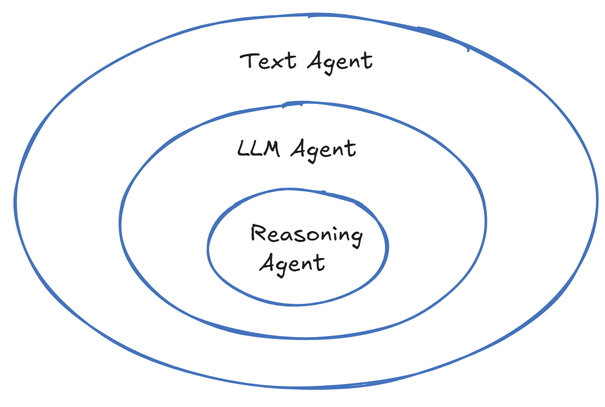

#### Generality 

Training: next-token prediction on massive text corpora.
Inference (few-shot): prompting for various tasks!

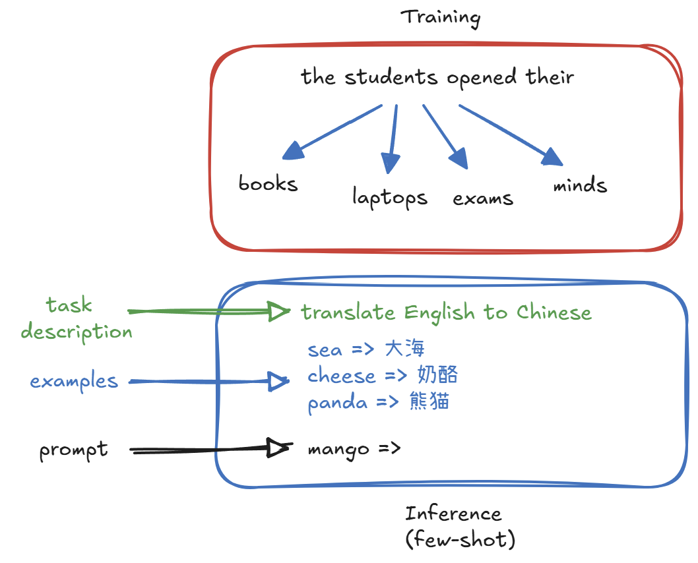

### History of LLM Agents

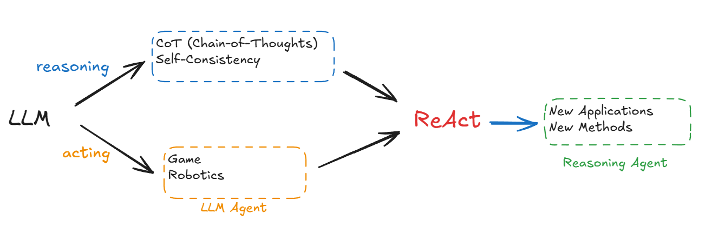

#### Chain-of-Thought Prompting - Intermediate steps

**What really matters are the imtermediate steps.**
Regardless of training, fine-tuning or prompting, when **provided with examples that include intermediate steps**, LLMs will **generate responses that also include intermediate steps**.

Why intermediate steps are helpful?
- Transformers generating intermediate steps can solve any inherently serial problem as long as its depth exceeds a constant threshold.
- Transformer generating direct answers either requires a hugh depth to solve or cannot solve at all.

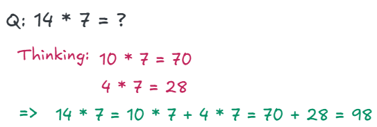

There're tns of practical implications of this theory, you may think about:
- generating more intermediate steps if you couldn't solve your problem
- combining LLM with external tools/search to support intermediate steps
- diagnosing LLM failures and limitations
- even path to AGI

#### How to trigger step-by-step reasoning whithout using demonstration examples?

"Let's think step by step"! (zero-shot reasoners)

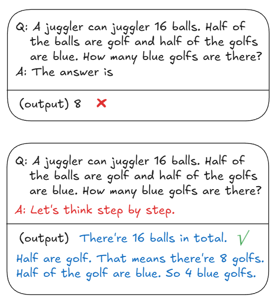

#### LLMs as Analogical Reasoners

**Do you know a related problem?**

Zero-shot is cool but usually significantly worse than few-shot... There is another approach, it's still zero-shot, but it's much better than zero-shot.
When solving a problem, we always profit from previously solved problems, using their results, or their methods, or tge experiences we accquired solving them.

#### RAG (Retrieval-Augmented Generation) for Knowledge

For the problem of knowlege, there is the paradigm of retrieval argumentation.

We have a retriever-based NLP.

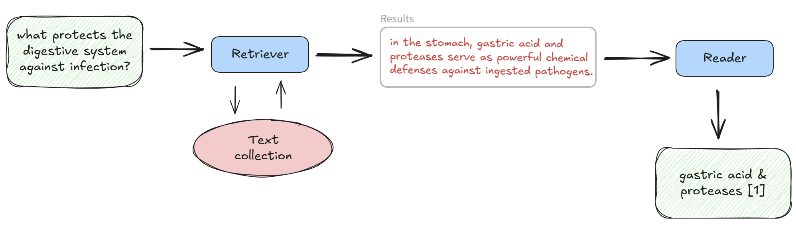

- what if there's no corpora? (e.g. who is the latest PM?)

#### Tool use

Introduce special tokens to invoke tool calls for search engines, calculators, etc.

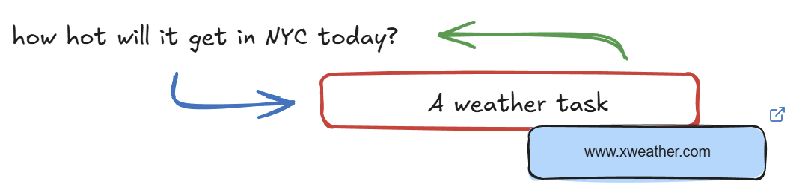

#### What if both needed?

We have the two paradigm, reasoning (CoT, etc.) and acting (RAG, tool use, etc.). Now a new paradigm ReAct generates both for reasoning and acting:
- reasoning -> acting -> reasoning -> acting -> ...

ReAct is simple and intuitive to use. 
- ReAct supports One-shot prompting / Few-shot / Fine-tuning.

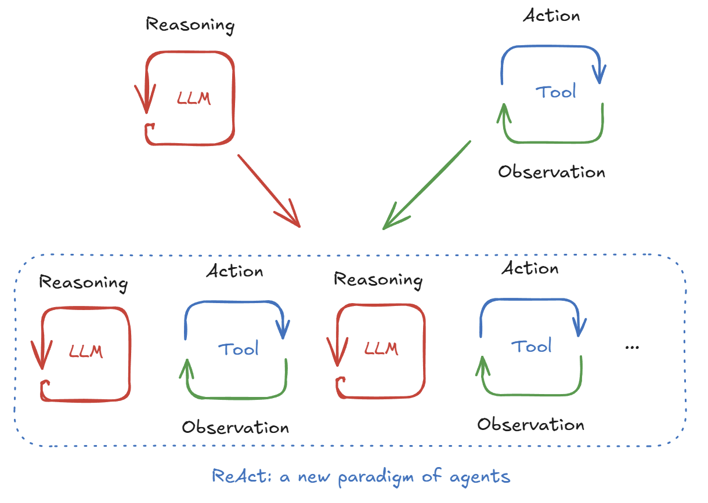

Synergy: acting supports reasoning, reasoning guides acting. 

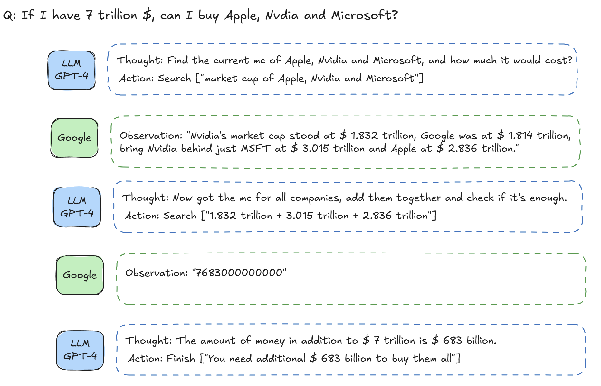

- Acting is helping reasoning to get real-time information or calculation results.
- Also, reasoning is constantly guiding the acting to plan the situation and re-plan the situation based on exceptions.

An example with exceptions:

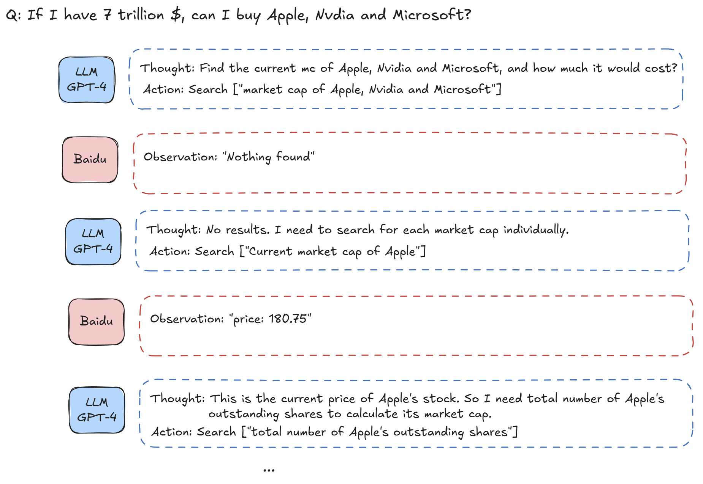

#### Many tasks can be turned into text games

People from robotics, video games, etc. are trying to apply this technique. You can try to turn all the observations into text.

You're in the midlle of the room. Looking quickly around you, you see a cabinet 6, a cabinet 1, a coffee machine 1, a countertop 3, a stove burner 1, and a toaster 1.

**Your task is to** : Put some pepper shakers in a drawer.

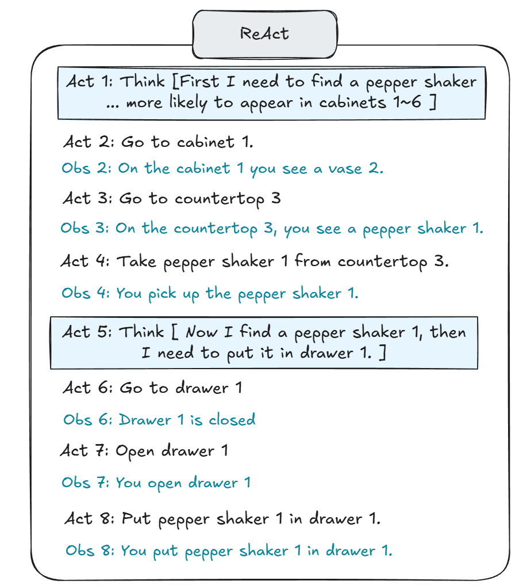

### Something More

#### Observation -> Action

I think the problem between different paradigms of agents (Deep learning, Symbolic AI, LLM) is the same: so you have some observation from the environment, you want to take some actions. 

**The difference is what kind of paradigm you use to process from observations to actions.**

But in LLM agent, thinking is very different from other pradigms (DL model, symbolic state). Because they have a fixed size, but you can think arbitrary long. And that brings the whole new dimension of inference time scaling. And that's why fundamentally reasoning agent is different.

