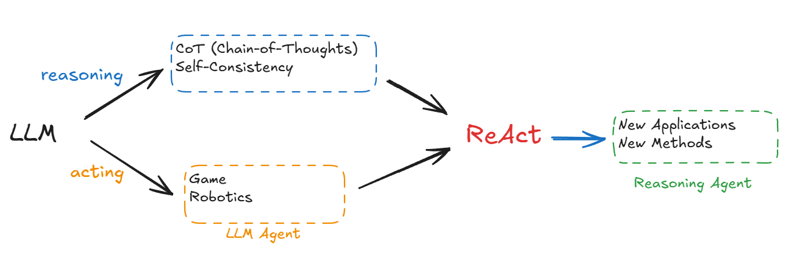
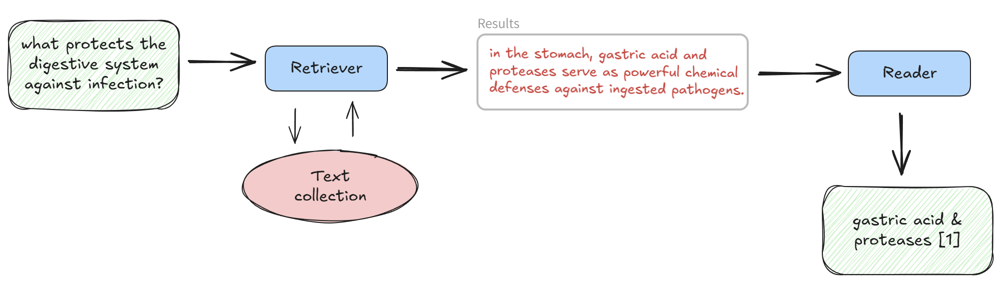
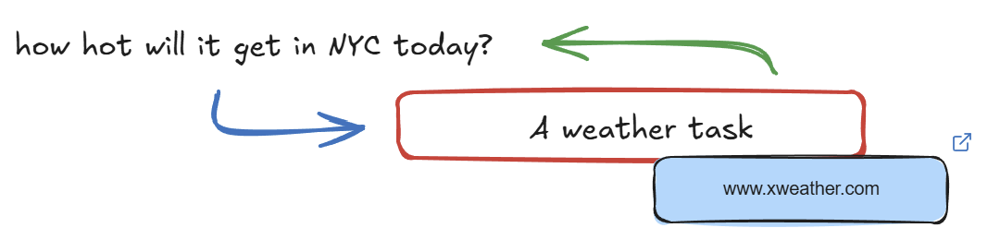
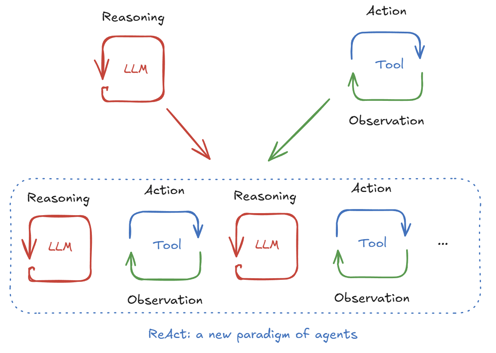
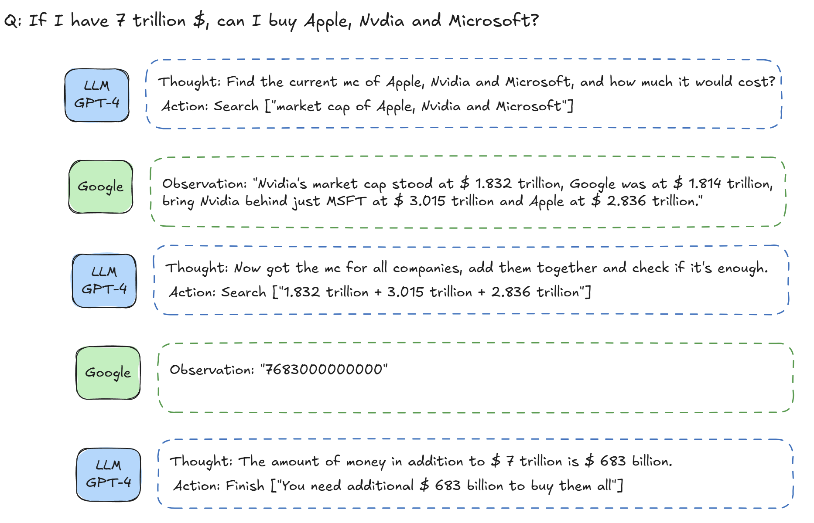
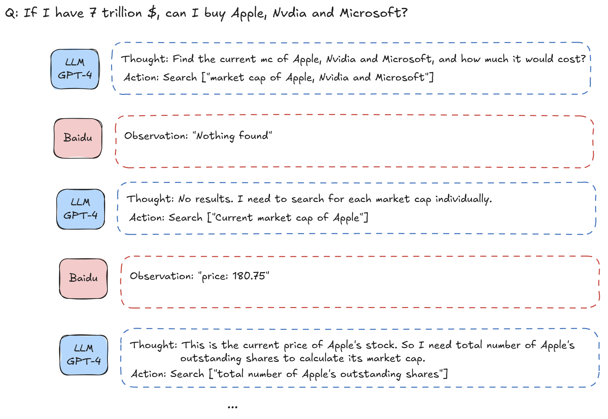

# AI Agent

## 

### History of LLM Agents

#### RAG for Knowledge

Retrieval-Augmented Generation: answer knowledge-intensive questions with extra corpora/a retriever.

We have a retriever-based NLP.

- what if there's no corpora? (e.g. who is the latest PM?)

#### Tool use

Introduce special tokens to invoke tool calls for search engines, calculators, etc.
- Unnatural format requires task/tool-specific fine-tuning~
- Multiple tool call

#### What if both needed?

We have the two paradigm, reasoning and acting. Now a new paragigm ReAct generates both for reasoning and actiing.

Synergy: acting supports reasoning, reasoning guides acting. 

Acting is helping reasoning to get real-time information. Also, reasoning is constantly guiding the acting to plan the situation and re-lan the situation based on exceptions. For example:

