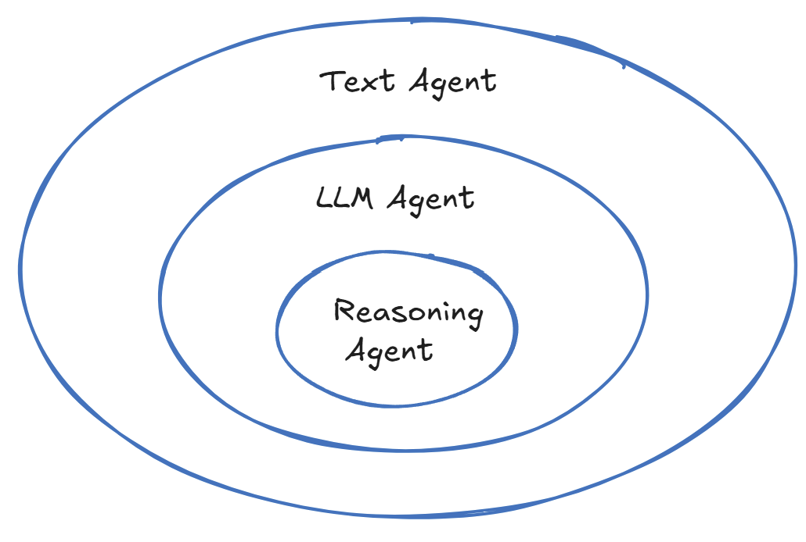
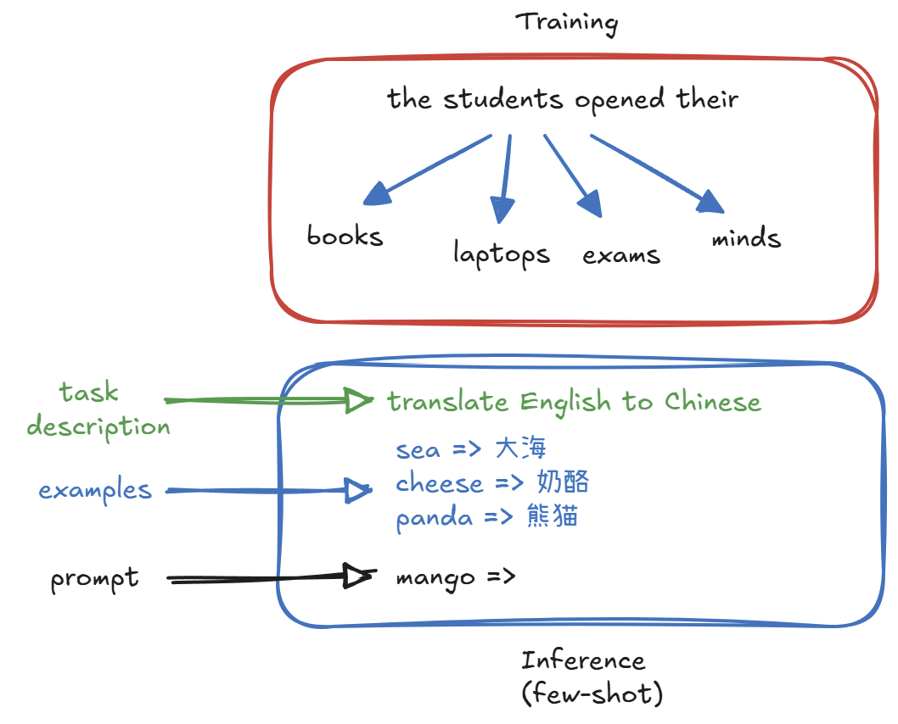
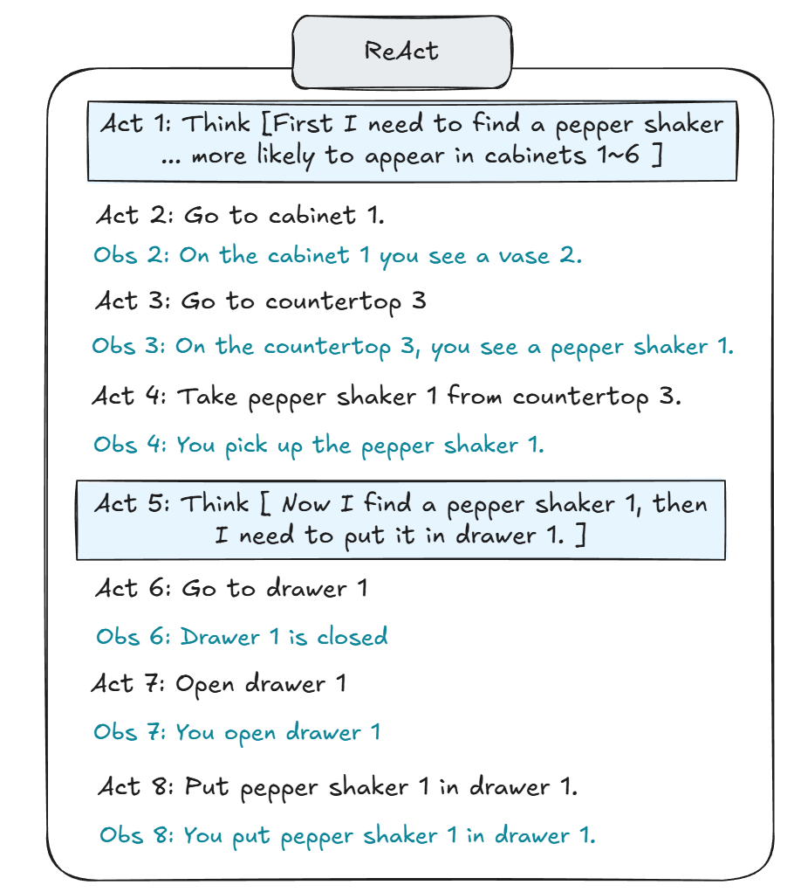

# AI Agent

### Concepts

#### What is "Agent"?

What is agent? An "intelligent" system that interacts with some "environment".
- Physical environments: robot, autonomous vehicles, etc.
- Humans as environments: chatbot
- Digital environments: Siri, AlphaGo, etc.

#### What is "LLM Agent"?

We have three categories.
- Text agent: Use text action and observation.
- LLM agent: use LLM to act.
- Reasoning agent: Use LLM to reason to act.

#### Generality 

Training: next-token prediction on massive text corpora.
Inference (few-shot): prompting for various tasks!

### History of LLM Agents

#### RAG (Retrieval-Augmented Generation) for Knowledge

For the problem of knowlege, there is the paradigm of retrieval argumentation.

We have a retriever-based NLP.

- what if there's no corpora? (e.g. who is the latest PM?)

#### Tool use

Introduce special tokens to invoke tool calls for search engines, calculators, etc.

#### What if both needed?

We have the two paradigm, reasoning (CoT, etc.) and acting (RAG, tool use, etc.). Now a new paradigm ReAct generates both for reasoning and acting:
- reasoning -> acting -> reasoning -> acting -> ...

ReAct is simple and intuitive to use. 
- ReAct supports One-shot prompting / Few-shot / Fine-tuning.

Synergy: acting supports reasoning, reasoning guides acting. 

- Acting is helping reasoning to get real-time information or calculation results.
- Also, reasoning is constantly guiding the acting to plan the situation and re-plan the situation based on exceptions.

An example with exceptions:

#### Many tasks can be turned into text games

People from robotics, video games, etc. are trying to apply this technique. You can try to turn all the observations into text.

You're in the midlle of the room. Looking quickly around you, you see a cabinet 6, a cabinet 1, a coffee machine 1, a countertop 3, a stove burner 1, and a toaster 1.

**Your task is to** : Put some pepper shakers in a drawer.

### Something More

#### Observation -> Action

I think the problem between different paradigms of agents (Deep learning, Symbolic AI, LLM) is the same: so you have some observation from the environment, you want to take some actions. 

**The difference is what kind of paradigm you use to process from observations to actions.**

But in LLM agent, thinking is very different from other pradigms (DL model, symbolic state). Because they have a fixed size, but you can think arbitrary long. And that brings the whole new dimension of inference time scaling. And that's why fundamentally reasoning agent is different.

