# Transformer

### Concepts

#### Encoder-Decoder

重新考察 CNN
- Featrue extraction - encoder
- Classification - decoder

重新考察 RNN
- Text to vector output - encoder
- Vector to output - decoder

编码器-解码器架构

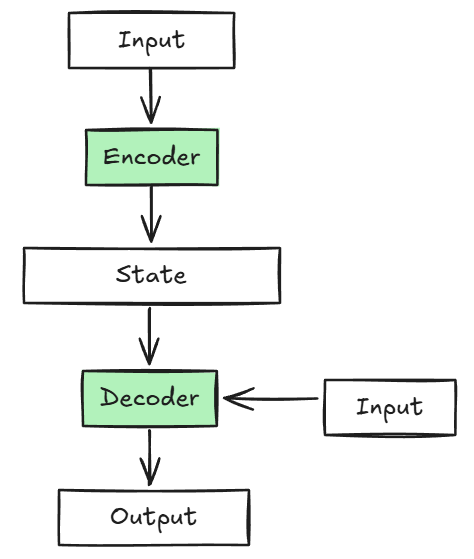

#### Seq2ses

序列到序列学习（seq2seq）最早用于语言翻译，它是一个 encoder-decoder 架构，编码器和解码器都是RNN。

训练时，解码器把目标句子作为输入，辅助训练。

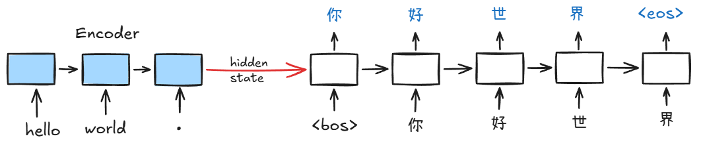

**效果评估 BLEU**

衡量生成序列的好坏，一般用 BLEU
- 例如： A B C D E F 是标签序列，预测序列是 A B B C D，那么 $p_i$ 代表连续 i 个单元序列预测准确：
$p_1= 4/5$, $p_2= 3/4$, $p_3= 1/3$, $p_4= 0$

**NOTE**: BOS - Begin of Sequence, EOS - End of Sequence

**束搜索**

束搜索，保存最好的k个候选，然后每个候选根据贪心算法得到其最好的结果，最后对k个结果做个总结汇总。

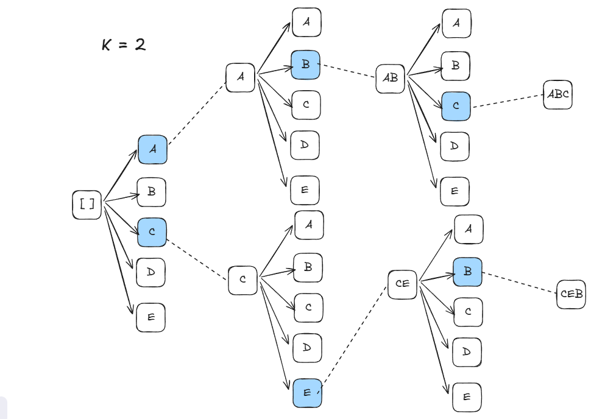

NOTE： K=1, 就是贪心；k=N, 即穷举；束搜索实际上是一种折中的方案。

#### 注意力机制

卷积/全连接/池化都只考虑"不经意线索"（“不专注于某个区域”）；注意力机制专注于特定的线索，我们称之为“查询”；查询是基于一系列 key-value 对。
注意力机制也成为注意力池化，它会根据 query 对环境里的 key-value 有偏向地选择输入。
- 对于一个词，它的 query 对应的就是我要找谁，也就是和它邻接的下一个词。
- key 可以理解为名片，描述我是谁。
- value 对应于该词的内容。

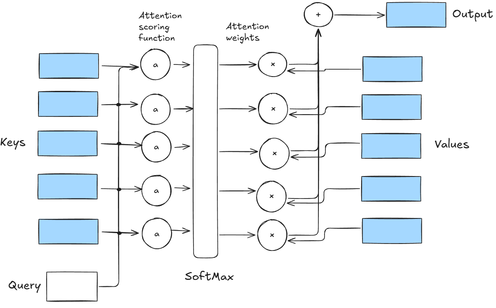

例如，我们有了一个字“塔”，要 Query 的是修饰自己的词，其他相应的 Key 会被亮出来, 我们依次求 q 向量和 k 向量的点积 $q · k$, 最终我们得到值最大的那么，就是 "埃菲尔"：

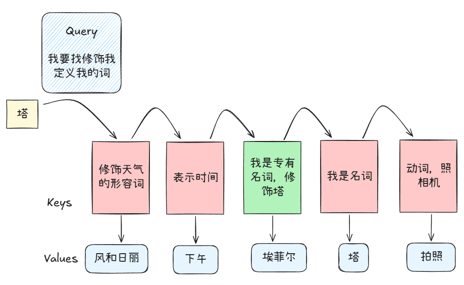

#### Transformer 的总体框架

在 transformer 中，每个单词都被转换成 512 维的词向量，用 512 个维度表示一个词的含义。
tansformer 不像 RNN，需要线性执行，为了解决这一问题，我们把位置编码 (Positional encoding) 加到词向量，这样每个词有了在句子中独特的编号，于是便有了位置信息：

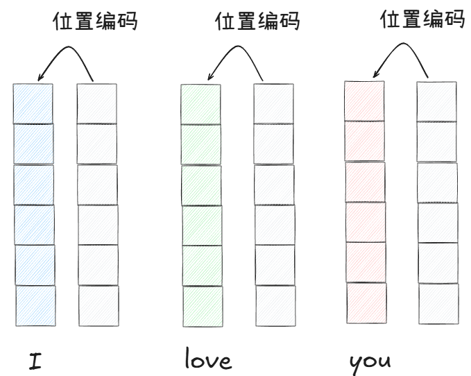

**transformer 中用一系列正弦和余弦的组合，对向量进行位置编码！**

我们输入的每个单词，都需要转换为 q-k-v:
- key: 我的身份是什么
- query: 我想知道什么
- value: 我的内容是什么

接下来，每个单词的 q 都要和所有单词的 k 进行点积运算，看看哪个匹配度最高。
Note: 这就是所谓的注意力机制，也就是说，我只关注我认为最值得关注的对象，和我无关的信息我就直接忽略它。

**接下来进入具体细节**

首先，我们用一个 $w_q$ 矩阵和第一个词向量相乘，得到 $q_1$ 向量 (这里的 $w_q$ 是经过预先训练的一组权重值)；
我们用 $w_k$ 矩阵和第一个词向量相乘，得到 $k_1$ 向量；我们用 $w_v$ 矩阵和第一个词向量相乘，得到 $v_1$ 向量.

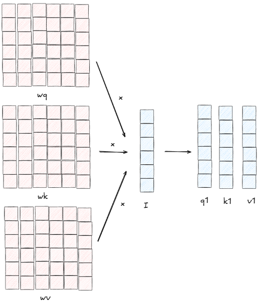

对其他词向量也做同样的操作：

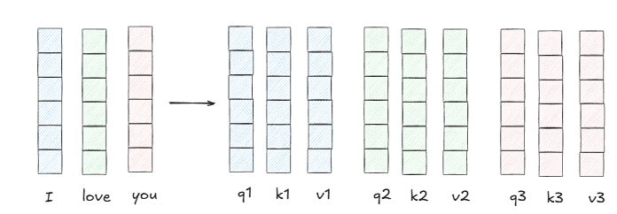

然后分别拿 $q$ 向量，分别和每个 $k$ 向量做点积，得到相似度（也包含和自己的相似度）。
也就是说，我们对每个词，去查找 (query) 所有的 k, 看相似度最高的匹配对象。

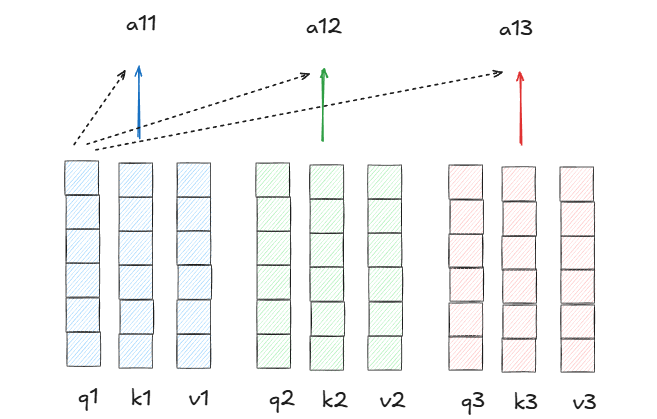

然后，再去查看对应单词的 v 向量，也就是具体的内容信息是什么。

得到的每个 $a$ 向量分别和对应的 $v$ 向量相乘, 我们以第一个向量 $a_{11}$ 为例:
$a_{11}$ 乘 $v_1$, $a_{12}$ 乘 $v_2$, $a_{13}$ 乘 $v_3$，加和得到新向量 $a_1$，这个 $a_1$ 就表示，在第一个词的视角下，按照和它相似度大小，基于权重把每个词的词向量都加到了一块。
这样，就把全部词的上下文信息都包含到第一个词当中了。

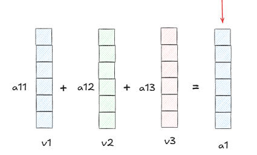

同样地，我们可以依次得到第二个词和第三个词对应的带文本信息权重的词向量，这组新的词向量，每一个都包含了位置信息和其他词上下文信息的一组新的词向量。

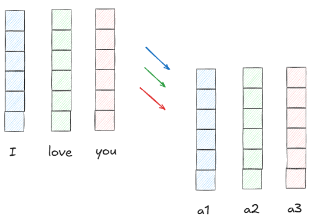

这就是注意力机制 attention 做的事情。

我们有 transformer 架构提如下：
- 第一步，是把输入的文字 "I love you" 转换成词向量矩阵；
- 第二步，加入位置信息，对应的是 positional encoding;
- 第三步，给每个词向量增加上下文信息，对应的是 Multi-Head Attention 这步；
- 第四步，给结果做归一化

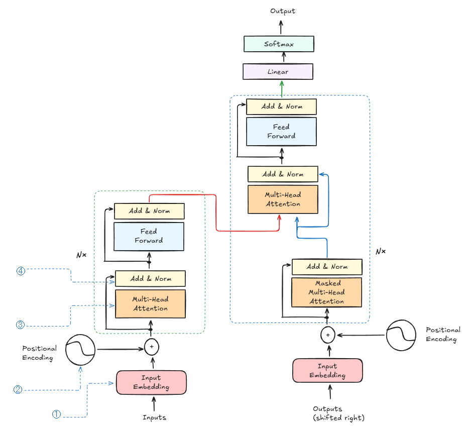

在架构图中，我们还有如下细节需要注意：
- 左边的编码器，红色的输出就是 K，V 矩阵，右边蓝色的输出是 Q 矩阵，那么 K, V, Q 就一起送进右边的解码器中。

- 我们在最终的输出，就是预测的下一个词在词表中的概率分布：

#### Multi-Attention 机制

Q 和 K 相乘，得到的结果再和 V 相乘，实际上 Q 和 K 相乘后，还有一些中间操作步骤，如：缩放 Scale，掩码 Mask，激活函数 Softmax 等，叫做 Scaled Dot-product Attention; 
多头注意力机制是什么呢？第一步我们把原始的 Q K V 经过线性变换，拆分成多组，每一组都进行 Scaled Dot-product Attention，最终把多组结果拼接起来，最后一步线性变换就得到了最终的结果：

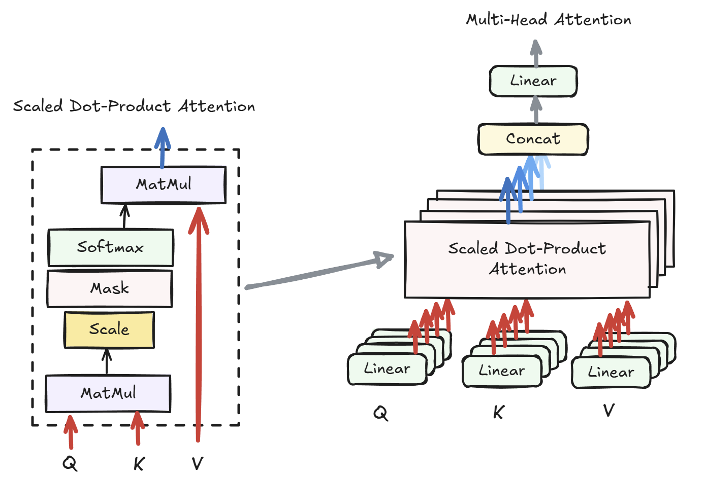

自然，Q 和 K 进行点乘缩放并且 softmax，随后和 V 再做点乘，我们能了解下面的公式：

$$
Attention(Q,K,V) = softmax(\frac{QK^T}{\sqrt{d_k}})V
$$

多头情况，先将 Q K V 矩阵经过多个权重矩阵 $W_{1,2, ... n}$ 拆分到多个头中，分别经过注意力机制运算：

$$
head_i = Attention(QW_i^Q, KW_i^K, VW_i^V),    i = 1, 2, ... h
$$

多头注意力的最终输出是将所有头拼接后再经过线性变换：

$$
MultiHead(Q,K,V) = Concat(head_1, head_2, ..., head_n)W^O
$$

**以 "I love you" 为例解释矩阵维度：**

假设：
- 输入序列："I love you"，分词后 3 个词，所以序列长度 $n = 3$
- 模型维度 $d_{model} = 512$ （每个词对应的词向量维度，如：I → $[0.23, ..., 0.14], (512-digits)$ ）
- 多头数量 $h = 8$ (默认是8，可以调整，h = 8 就是：把注意力机制"复制"8份，用不同的参数并行运行：头1 可能关注位置关系，头2 可能关注主谓关系，头3 可能关注语义相似度，...)
- 每个头的维度 $d_k = d_v = \frac{d_{model}}{h} = \frac{512}{8} = 64$

各个矩阵的维度如下：

1. **输入 Q, K, V**: $3 \times 512$
   - 3 行：代表 3 个词 ["I", "love", "you"]
   - 512 列：每个词的向量维度

2. **权重矩阵** $W_i^Q, W_i^K, W_i^V$: $512 \times 64$
   - 将 512 维的词向量映射到 64 维 ($d_k = 64 = 512 ÷ 8$)

!!! question 权重矩阵的维度为什么是 $512 \times 64$
    输入 Q："I love you" , 3 个词，每个词 512 维。
    目标：把每个词从 512 维映射到 64 维。

    输出应该是 $3 \times 64$，矩阵乘法计算：
    $$(3 \times 512) \times (W_i^Q) = (3 \times 64)$$

    根据矩阵乘法规则：
    $$(3 \times \textcolor{red}{512}) \times (\textcolor{red}{512} \times 64) = (3 \times 64)$$

    中间的维度必须相同（都是 512）才能相乘，所以：$W_i^Q$ 必须是 $512 \times 64$！

3. **变换后的矩阵** $QW_i^Q, KW_i^K, VW_i^V$: $3 \times 64$
   - $(3 \times 512) \times (512 \times 64) = 3 \times 64$

4. **每个头的输出** $head_i$: $3 \times 64$
   - 经过 attention 后，输出仍是 $3 \times 64$

5. **拼接后** $Concat(head_1, ..., head_8)$: $3 \times 512$
   - 将 8 个 $(3 \times 64)$ 的矩阵沿列拼接
   - $3 \times (8 \times 64) = 3 \times 512$

6. **输出权重矩阵** $W^O$: $512 \times 512$
   - 将 512 维映射回 512 维

7. **最终输出** $MultiHead(Q,K,V)$: $3 \times 512$
   - $(3 \times 512) \times (512 \times 512) = 3 \times 512$
   - 输出和输入维度完全相同，仍然是 3 个词，每个词 512 维

#### 训练中的最终输出

以 "I love you" → "我爱你" 为例：

我们右边先有 "\<BOS\>" 它有个词向量，基于左边 "I love you" 生成的 K-V ，进行计算 $Q · K^T$ 生成注意力权重 $w$，然后 注意力权重点乘 v 就得到了上下文向量（Context Vector）: $x = w· v$。 
上下文向量经过 Feed Forward 对信息再加工，中间经过升维（用输入 $x_{1 \times 512}$ 和 $w_{512 \times 2048}$ 相乘, 得到 $x_{1 \times 2048}$ ），ReLU 激活，再降维，使信息内容增强。
最后，又经过一个全连接层 Linear, 把转换后的 512 维度的向量映射到词表大小 50000 (模型认识多少词)。

**note**: decoder 的输入并不是 "我爱你"，而是 shifted “BOS我爱”, 原因在于，我们要用于预测：
- \<BOS\> 对应的标签是 "我"； 
- "我" 对应的标签是 "爱"； 
- "爱" 对应的标签是 "你"。

另外，Masked Multi-Head 部分，加上了一个遮盖，每次都遮住后面的内容，不提前公布答案。

