# Model Context Protocol

### 1. What is MCP

#### About MCP

MCP (Model Context Protocol) is an open-source standard for connecting AI applications to external systems.
Using MCP, AI applications like Claude or ChatGPT can connect to external systems, enabling them to access key information and perform tasks.
- data sources (e.g. local files, databases)
- tools (e.g. search engines, calculators)
- workflows (e.g. specialized prompts)

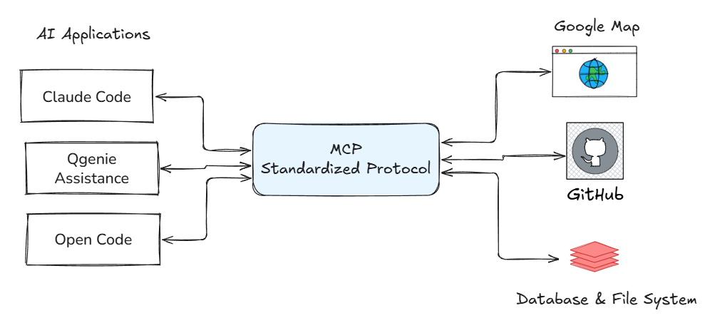

What can MCP enable?
- Agents can access your Google Calendar and Notion, acting as a more personalized AI assistant.
- Claude Code can generate an entire web app using a Figma design.
- Enterprise chatbots can connect to multiple databases across an organization, empowering users to analyze data using chat.
- AI models can create 3D designs on Blender and print them out using a 3D printer.

Why does MCP matter?
- MCP reduces development time and complexity when building, or integrating with, an AI application or agent.
- MCP provides access to an ecosystem of data sources, tools and apps which will enhance capabilities and improve the end-user experience.
- MCP results in more capable AI applications or agents which can access your data and take actions on your behalf when necessary.

#### Architecture

The Model Context Protocol includes the following projects：
- MCP Specification: A specification of MCP that outlines the implementation requirements for clients and servers.
- MCP SDKs: SDKs for different programming languages that implement MCP.
- MCP Development Tools: Tools for developing MCP servers and clients, including the MCP Inspector.
- MCP Reference Server Implementations: Reference implementations of MCP servers.

MCP follows a client-server architecture where an MCP host — an AI application like Claude Code — establishes connections to one or more MCP servers. The MCP host accomplishes this by creating one MCP client for each MCP server. Each MCP client maintains a dedicated connection with its corresponding MCP server.

Local MCP servers that use the STDIO transport typically serve a single MCP client, whereas remote MCP servers that use the Streamable HTTP transport will typically serve many MCP clients.

The key participants in the MCP architecture are:
- MCP Host: The AI application that coordinates and manages one or multiple MCP clients
- MCP Client: A component that maintains a connection to an MCP server and obtains context from an MCP server for the MCP host to use
- MCP Server: A program that provides context to MCP clients

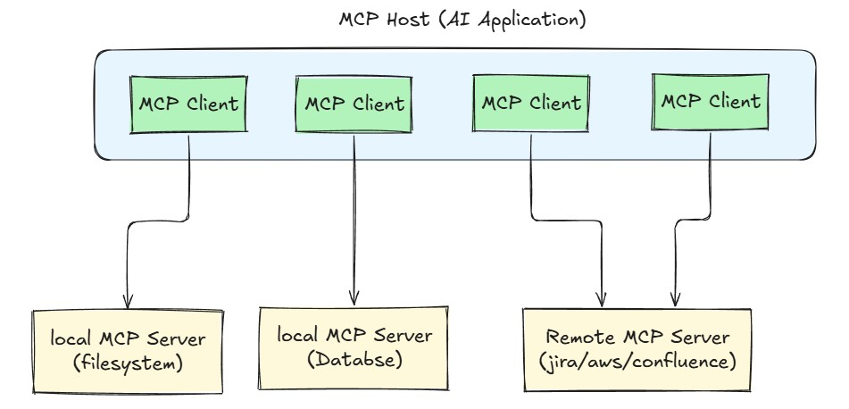

MCP consists of two layers:
- Data layer: Defines the JSON-RPC based protocol for client-server communication, including lifecycle management, server features, client features and utility features.
- Transport layer: Defines the communication mechanisms and channels that enable data exchange between clients and servers, including two transport mechanisms: stdio transport and streamable HTTP transport.

Data Layer Protocol
A core part of MCP is defining the schema and semantics between MCP clients and MCP servers.
- Primitives: It is the part of MCP that defines the ways developers can share context from MCP servers to MCP clients.
- Lifecycle management: The purpose of lifecycle management is to negotiate the capabilities that both client and server support.

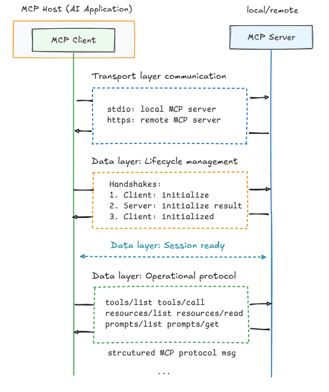

**Primitives**
MCP primitives are the most important concept within MCP. They define what clients and servers can offer each other. 

MCP defines three core primitives that servers can expose:
- Tools: Executable functions that AI applications can invoke to perform actions (e.g., file operations, API calls, database queries)
- Resources: Data sources that provide contextual information to AI applications (e.g., file contents, database records, API responses)
- Prompts: Reusable templates that help structure interactions with language models (e.g., system prompts, few-shot examples)

**An example:**

Step 1: 
User asks the Host/Agent: “Review the PR”
Agent sends the user request + available MCP capabilities (e.g., prompts/tools) to the LLM.
LLM requests discovery: action - prompts/list

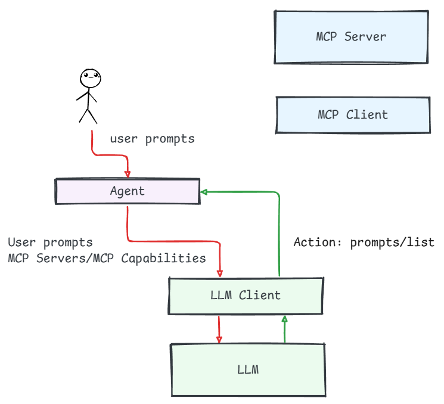

Step 2:
Agent calls MCP (MCP client → MCP server) prompts/list, and receives a list of available prompt templates.

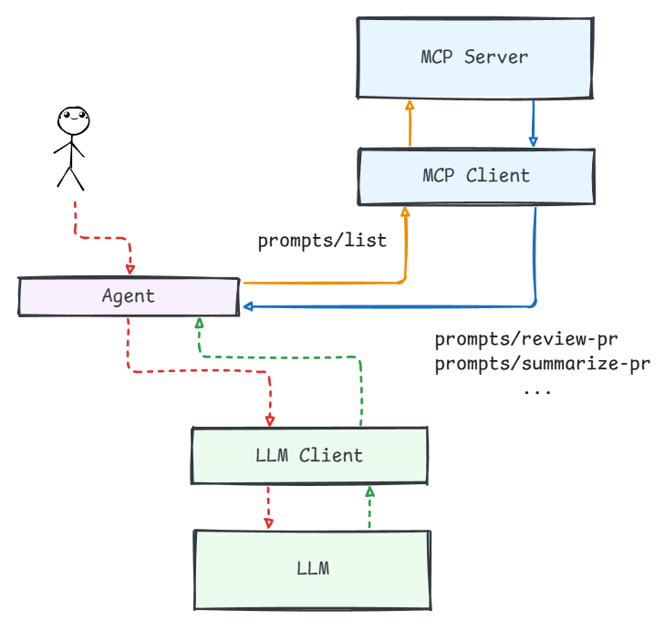

Step 3:
Agent sends that prompt list back to the LLM.
LLM decides it needs a review template and returns an action: prompts/get("review-pr").

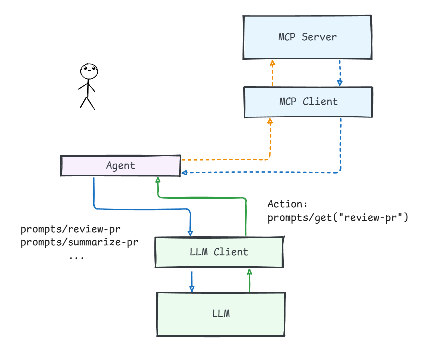

Step 4: 
Agent calls MCP prompts/get("review-pr"), receives the prompt template, and keeps it in the conversation context.

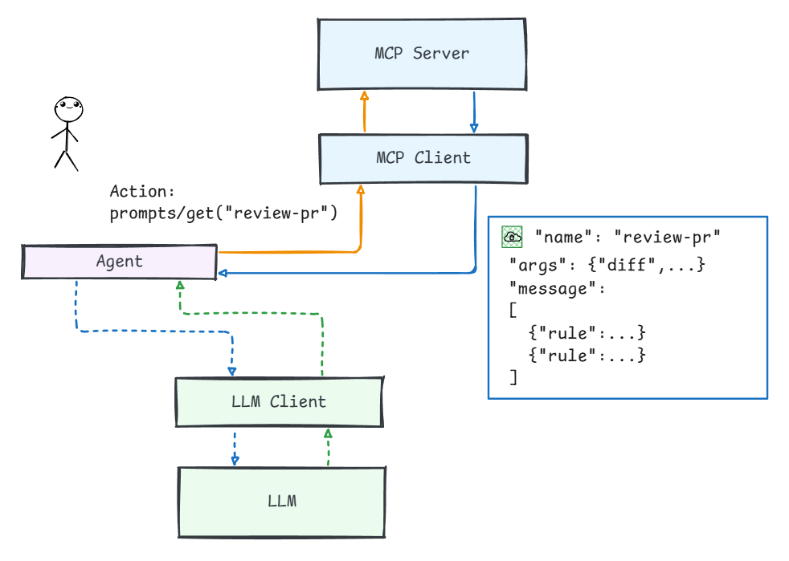

Step 5: 
Agent sends the template (plus the user request / current context) to the LLM.
LLM decides the next step and returns an action: tools/call(git_diff).

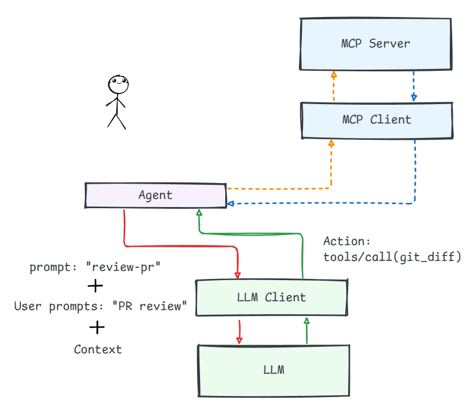

Step 6: 
Agent executes the tool via MCP and gets the diff output.

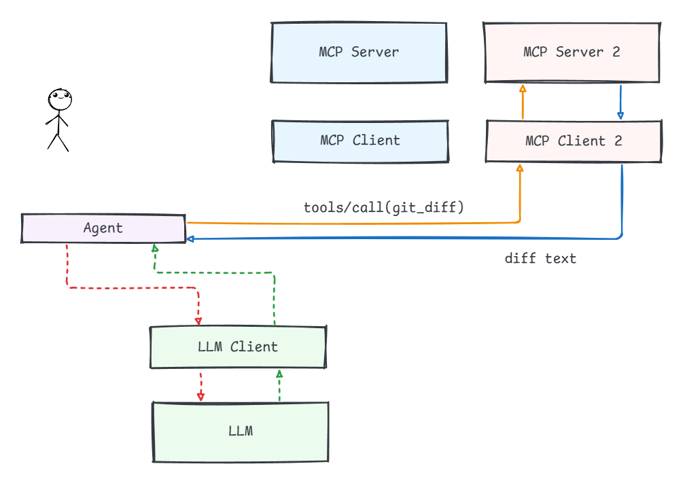

Step 7: 
Agent sends the diff along with the context back to the LLM.
LLM returns final answer: the review result.

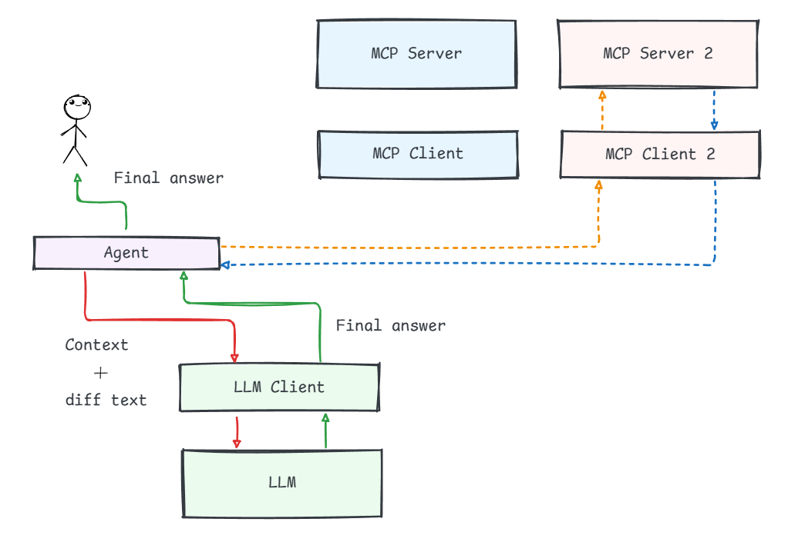

We have the sequence diagram: 

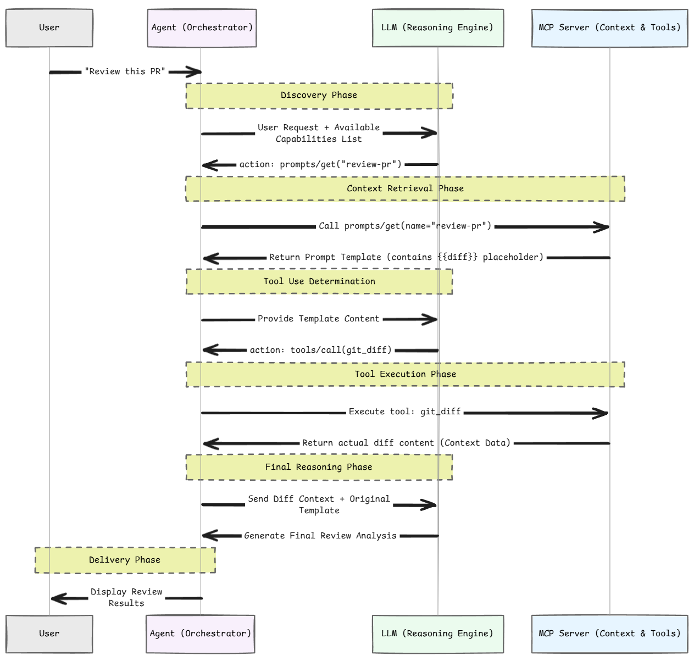

#### Servers

MCP servers are programs that expose specific capabilities to AI applications through standardized protocol interfaces.

Common examples include file system servers for document access, database servers for data queries, GitHub servers for code management, Slack servers for team communication, and calendar servers for scheduling.

#### Clients

### 2. Develop with MCP

#### Connect to local MCP servers

#### Connect to remote MCP servers

#### Build an MCP servers

#### Build an MCP client

#### SDKs

#### Security

### 3. Developer tools

#### MCP Inspector

Reference: https://modelcontextprotocol.io/docs/getting-started/intro