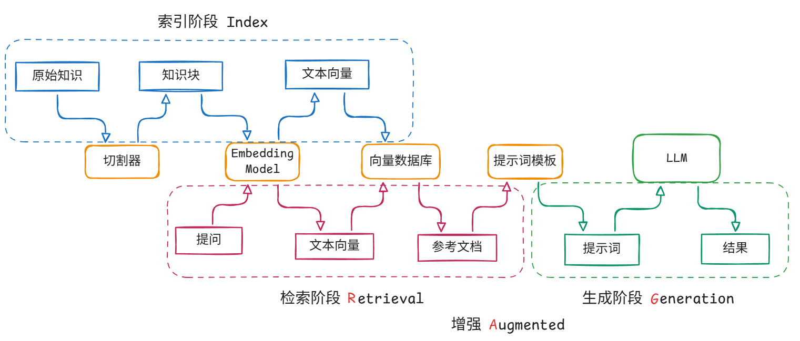
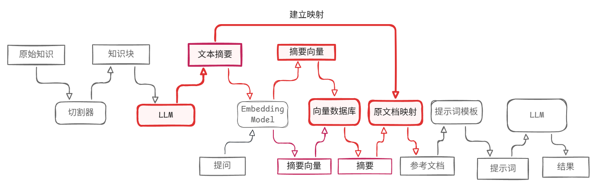
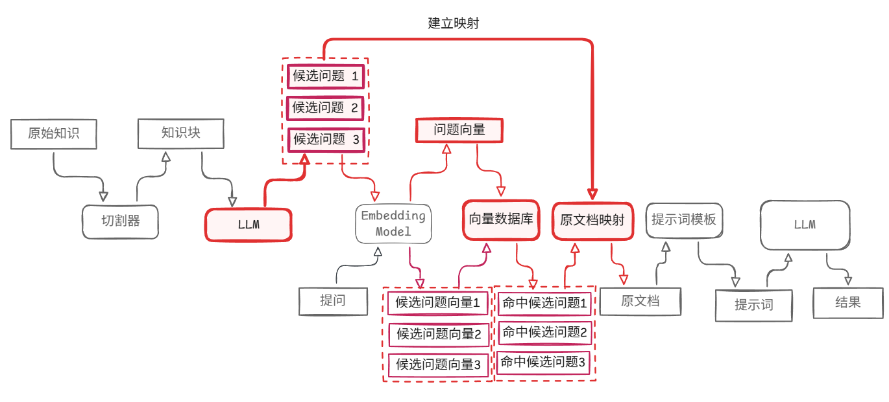
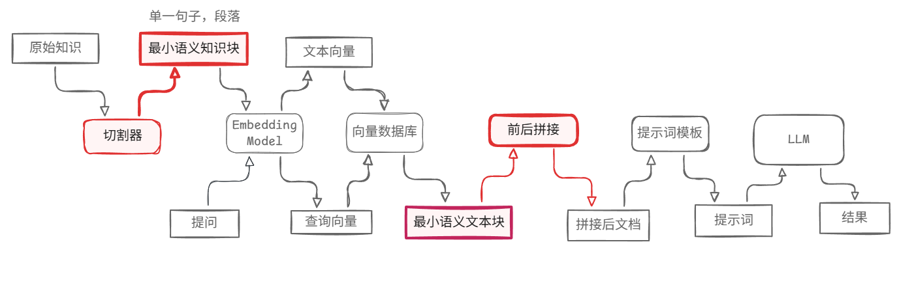
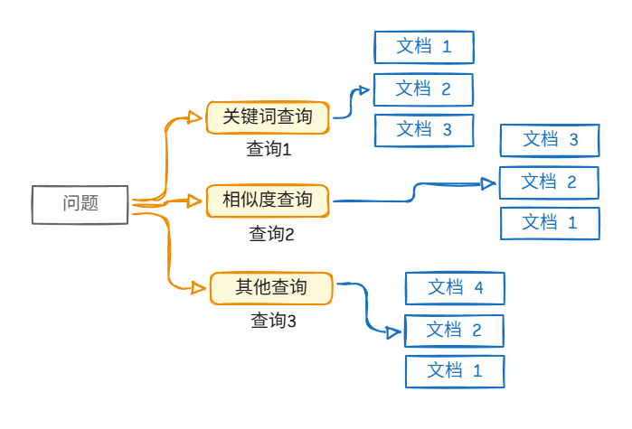
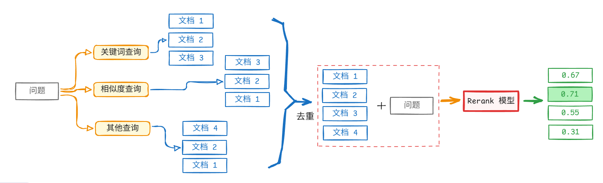
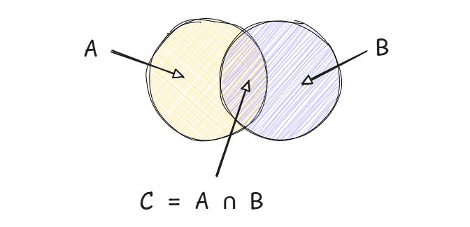

## RAG

### RAG 基础

#### 什么是 RAG

如果没有 RAG，LLM 无法回答私域问题，因此无法深入运用到企业内容。
LLM 的理解和归纳能力足够，问题是不知道答案去哪找。让大模型**从知识库中检索出合适的参考内容**，并据此回答，这便是 RAG 的核心。
- 客户机器人
- 政策查询
- AI 搜索引擎（kimi, 豆包）

RAG = Retrieval Augmented Generation



RAG 有三大核心：知识库，检索，回答
- 知识库
- 检索
- 回答

#### 索引阶段

**1. 收集知识**

收集知识，我们要准备知识库，需要知道：
- 知识存在哪？比如：word，excel，pdf，数据库，例如：如果是pdf，本质上是图片，我们可能还需要一些 ocr 的手段进行处理。
- 数据的格式？文字，表格，还是图片，视频。如果我们处理的数据涉及到图片或者视频，那么就需要考虑用上多模态。
- 数据清洗，我们通常用一些常见的方案进行文本清洗工作，但是大模型的容错度较高，因此往往粗洗就好，先快速迭代起来。

**2. 文档切分**

文档切分，核心要**保证语义的连贯性**：
- 划分后的一段文字中，语义必须统一完全；
- 太长会导致语义不统一，影响检索效果；
- 太短会导致语义不完全，影响回答质量。

因此，我们要保证文本块不能太长也不能太短。
例如，一个语义块中，如果包含了太多不相关的信息，一定程度上会影响检索效果。
但是如果太短，包含内容不完整，会影响回答的质量。如果我们针对某个事情提问，往往会导致答案不完整。

切分文档，可以基于以下方案：
- 固定大小，如：基于字符数，token数量进行切换。
- 按照标点符号切分，如：换行符。
- 按照文档结构划分，如：标题，章节等。
- 按照语义划分，将句子按照相关性合并成段落。
实际上，效果从上至下越来越好，但是难度也越来越大。

有些时候，我们也不一定非要按照固定套路，如，假设我们有现成的知识储备库，以问答形式做好，就几乎不需要再费力切分了。
如，我们本来就有了整理好的以问答形式的文档，如下：

```txt
Question: what' your name?
Answer: Yifang

Question: What's your favourite food?
Answer: Steak

Question: What is self-driving?
Answer: Self-driving is ...
```

**3. 文本向量**

文本转换的方案有两种：稀疏向量，稠密向量。

稀疏向量，简而言之，把词语作为表头索引，有几种常见的方法：
- 不去重词袋法: 每个词根据次数，在对应位置标记次数;
- 去重词袋法: 基于每个词出现与否，标记 0 或者 1;
- TF-IDF: 每个词出现的频率及重要程度, 计算一个概率值。

Word Embedding, 稀疏向量显然不适合文本量较大的情况，因为存在大量零元素。
- 不管内容简单还是复杂，我们使用固定的维度去进行映射。维度可能是 1024，可能是512，或者768。
- 这种词嵌入的方式，可以捕捉到语义相关性，如：北京-中国，巴黎-法国更能互相关联，其实和 transformer有点类似。

**4. 向量存储**

我们已经做过了文本的分块，embedding构建成向量，接下来需要简历向量数据库。
向量数据库和普通数据库的区别在于，普通数据库通过键值对精准匹配；而向量数据库在于语义近似。

向量数据库存的通常不只是向量，向量数据库一般会同时存：
- `vector`：文本块的向量
- `text`：原始文本内容
- `metadata`：元数据，比如：
  - 来源文件名
  - 段落位置
  - 标题
  - 时间
  - 标签
  - 权限信息

这样检索时不仅能找相似内容，还能做过滤，比如：
- 只查某个文档
- 只查最近30天内容
- 只查某个用户有权限看的数据
- Top K 相关的内容

RAG 里常见的向量数据库有：FAISS，Milvus，Chroma，等等。

#### 检索阶段

**1. 相似度检索**

我们如何衡量两个向量的相似度？我们有两种衡量方式：
- 余弦相似度：用向量的夹角来衡量相似度，如果夹角越大，相似度越小。
- 欧式距离：用距离表示相关性，距离越远，相关度越低。

**2. 关键字检索**

我们把关键词从一系列文档抽取出来，构建一个关键词和文档的映射表（一对多）。
我们在问问题的时候，系统会抽取关键词，并且基于关键词进行检索，找到对应的文档。

**相似度检索 vs 关键字检索**

余弦相似度检索，可以挖掘出用户的真实意图，哪怕用户的表述比较绕或者是间接的表述，它也能精准捕捉到用户的意图。

而关键字检索适合的是特定场景下，我们有专业的知识术语，如，查找计算机相关的内容或者专业的法律条款，可能需要精准匹配。

#### 生成阶段

在生成阶段，需要正和提示词和参考文档，把问题提交给模型，核心还是大模型的选择。


### RAG 进阶

#### 检索优化: Small to big

文本块太小，影响检索效果；文本块太大，影响生成效果。
因此我们考虑用小的文本块检索，大的文本块生成。

**1. 摘要检索**

我们在构建向量数据库时，通常不是用原始文本，而是通过摘要构建索引数据库。所以我们要用 LLM 先对原始问题做一个摘要提取，然后基于摘要构建索引。
用户提问的时候，查找的过程是先去索引数据库查找，得到的是摘要；再根据摘要块的映射关系找到对应原文，供后续生成使用。



Note：
实际上，向量库除了 `vector`、`text` 之外，还会存 `metadata`，这个 `metadata` 就是保存映射关系的最常见位置。
“映射回查原文”的关系，是在索引阶段生成摘要时顺手建立的，最常见做法是：
- 原文切块
- 给每个原文块一个 `chunk_id`
- 用 LLM 生成该块摘要
- 存摘要向量时，把 `original_chunk_id` 或 `parent_id` 写进 metadata
- 检索命中摘要后，根据这个 ID 回查原文

**2. 候选问题检索**

有时候，不是给知识块做摘要索引，而给知识块生成一组可能被用户问到的候选问题（同样基于 LLM 提取），再用这些问题去建索引，检索命中后回到原文。



这样做的优势是，通过预生成候选问题，可以让用户提问更容易匹配到相关文本位置，从而提升检索效果。

**Note:**
用 prompts 做，同样能达到一样的效果，但是缺点是速度会变慢，因为每次查询都要多一次 LLM 调用！
先让 LLM 帮你处理用户问题，再去检索；只要这一步存在，就会多一次 LLM 调用。
在检索阶段，通常不会先让 LLM 去理解用户问题，而是直接把问题交给 embedding model 转成查询向量。这并不表示系统“不理解”问题，而是由 embedding model 负责做语义编码，用于检索。

__在最基础的 RAG 流程里，通常就是先直接查__。\
也就是说，即使用户的问题和知识库可能完全不相关，系统也往往会先走这条路：

```txt
用户问题
 -> Embedding Model
 -> 查询向量
 -> 向量数据库检索
```

__这一步不一定先让 LLM 参与。__

为什么会这样设计？因为基础 RAG 的默认假设是：先检索，再根据检索结果决定后续怎么处理。
也就是说，系统并不会一开始就知道：
- 这个问题是不是知识库相关
- 这个问题是不是跑题
- 这个问题能不能在库里找到答案

所以它通常先做一次 retrieval。

更高级的系统，可能在检索前加一个 LLM 分类器，然后决定走哪条线路。这样，还是会多一次 LLM 调用，也就是说，速度变慢了。

**3. 句子窗口检索**

句子窗口检索，也是一种优化方案。
检索时用更小粒度的语义单元，提高命中精度；生成时再把命中的小块向前后扩展/拼接，恢复上下文。



#### 检索优化: 多路召回

单一路径检索往往会有盲区：
- 纯向量检索：语义强，但有时不够精确
- 纯关键词检索：精确，但容易漏掉语义近似表达
- 纯摘要索引：压缩得好，但可能丢细节
- 纯最小块检索：定位准，但上下文可能不够

多路召回是一种检索优化方案，它通过并行采用多种检索策略（如向量检索、关键词检索、摘要检索、候选问题检索等）来扩大候选结果覆盖范围，从而提升召回率，并为后续重排和生成提供更高质量的参考内容。



Note: 目前，最终合并排序的策略也有多种，这里不详细展开。

#### 检索优化: Rerank

进一步，我们还有 Rerank 方案，先多路召回，合并候选，去重，然后把“问题 + 候选文档”送进 rerank 模型重新打分排序。



Rerank 模型是比较耗资源的，因此我们先用粗糙的算法先粗筛一遍，再用 rerank 二次筛选，这样兼顾了效率和准确度。

#### 生成优化

生成阶段，我们也需要考虑优化。优化什么？我们在检索阶段可能会得到很多检索结果，生成阶段的优化在于，如何利用找到的资料，让 LLM 更忠于检索到的资料，让检索结构更清晰，使 LLM 减少幻觉，从而使输出更符合要求。

常见的问题是，有可能把一堆检索材料给大模型，会导致上下文溢出；另外，如果我们直接丢给 LLM，可能因为知识语义不连贯，导致大模型的回答效果并不好。

#### 生成优化：refine 模式

Refine 模式，是 RAG 生成阶段的一种回答组织方式。不是把所有检索到的文档一次性塞给 LLM 生成答案，而是让 LLM 按文档顺序逐步更新答案。

问题 + 所有参考文档一次性喂给 LLM，如果参考文档很多、很长，就会有问题：
- prompt 太长
- 容易超过上下文窗口
- 噪声太多

LLM 一次吃太多信息，整合效果未必最好。假设我们得到了3份检索文档A，B，C，refine 模式通常就是这种链路：
```txt
第1次：问题 + A -> answer_1
第2次：问题 + B + answer_1 -> answer_2
第3次：问题 + C + answer_2 -> answer_3
```

最后取：
```txt
answer_3
```

这样，我们每一次都对上一次的答案做修正（refine），从而得到最佳答案。这样既兼具了所有的知识块，又避免了上下文的溢出。
但是，refine 模式它是串行逐步修订的，所以慢、贵，而且前面答案的偏差会一路传下去。

**batch refine**

如果文档很多，一个个文档去进行 refine 恐怕非常低效，那么我们就考虑把文档分批再进行 refine，这样比逐文档refine更加实用，那么这个思路大概叫做：
- group refine
- batch refine

```txt
第1次：问题 + batch_1 -> answer_1
第2次：问题 + batch_2 + answer_1 -> answer_2
第3次：问题 + batch_3 + answer_2 -> answer_3
```

Batch refine 在多文档、长上下文、总结归纳类任务中是一种常见且合理的生成优化方案，但它并不是通用问答型 RAG 的默认主流架构。对于一般知识问答，工业系统通常更倾向于通过强检索、rerank 和上下文压缩，把输入控制在较小范围内，然后一次性生成答案。

#### 其他优化

**1. 改写提问**

什么时候需要改写提问？
- 有时候用户提的问题乱七八糟，可能需要进行改写。
- 多轮对话的场景，如：“他” 是谁？我们在前面的对话中已经有了相关讨论，这时候需要把“他”替换成实际的谁进行检索。
- 复杂提问，如：“当前A股中推荐一只股票”，这种问题需要拆分为多个子文字，并且最终组合为一个答案。

**2. 合理利用元数据**

利用 meta data 能做什么：
- 过滤，比如：我们通过时间或者描述，剔除不相关或者过期文档。
- small-to-big 回查，如：通过 meta data，能将语义块和上下文进行关联。
- 权限控制，如通过 user_group 可以限制用户的权限，只看有权限访问的文档。

#### RAG 的评估指标

RAG 常见的评估指标，包括：
- 准确率：直接站在用户视角，看答案是否符合实际情况。
- 重视度：生成的内容是否忠实于提供的上下文的背景
- 召回率，精确率，F1：召回率看重是不是找到全，精确率看重是不是找的准，F1 对二者做了一个综合评估。

如下图所示：我们有所有相关知识 $A$，检索出来的知识 $B$，检索出来的准确知识就是 $C$。



召回率（Recall）：

$$
\text{Recall} = \frac{C}{A}
$$

精确率（Precision）：

$$
\text{Precision} = \frac{C}{B}
$$

F1 分数：

$$
F_1 = \frac{2 \cdot \text{Recall} \cdot \text{Precision}}{\text{Recall} + \text{Precision}}
$$

如果直接代入 $A,B,C$，进一步可化简为：

$$
F_1 = \frac{2C}{A + B}
$$

#### RAG 的评估方法

我们有两种方法进行 RAG 评估：
- 模型自动评估：准备测试样本和标准答案，有两种常见方案：
    - 1. 将问题和模型作答结果一并喂给 Cross-Encoder 模型，将二者相关性进行评估；
    - 2. 评估标准答案和模型回答的文本相似度，进行打分。
- 人工评估：我们基于相似度评估结果，再进行人工干预。

从工程投入角度看，通常以自动评估为主，人工评估为辅但不可缺！目前，有一些第三方评估平台：LangSmith，Langfuse，Rags 等平台或者框架。

我们如何规划技术工作？
小步快跑，快速迭代：这个在 RAG 中尤其重要，先构建基本流程，得到 base 版本，确立评估体系，逐步迭代于优化。

RAG vs. 微调
- RAG 是不改变大模型内部结构，通过外部知识让大模型回答私域问题；微调是通过内部的知识让大模型重新学习。
- RAG 偏工程，复杂但简单；微调难度高，需要算法功底，高质量的资料数据，和硬件资源。

